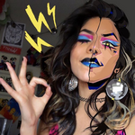
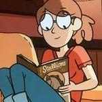
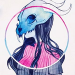
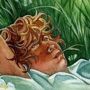
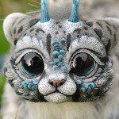

<!DOCTYPE html>
<html>
<head>
<title> Home Page</title>
	<link href="data:image/x-icon;base64,AAABAAEAEBAAAAEAIABoBAAAFgAAACgAAAAQAAAAIAAAAAEAIAAAAAAAAAQAAAAAAAAAAAAAAAAAAAAAAAAAAAAAAAAAAAAAAAAAAAAANVZyMAAAAAAAAAAAAAAAAAAAAAAAAAAAAAAAAAAAAAAAAAAAAAAAAAAAAAAAAAAAAAAAAAAAAAAAAAAANVZyMDVWcv82ZH/ENVZyEAAAAAAAAAAAAAAAAAAAAAAAAAAANVZyQDVWchAAAAAAAAAAAAAAAAAAAAAAAAAAAAAAAAA1VnL/SrLK/zVadvg2ZoJbAAAAADVWciA2ZYCQNV978DVWcv81VnJAAAAAAAAAAAAAAAAAAAAAAAAAAAAAAAAANVZy/13j+f9W2vD/PXaR/TVhfOI0Xnr/LavG/yXM6P8zZYH/NVZyEAAAAAAAAAAAAAAAAAAAAAAAAAAAAAAAADVWcv9d4/n/XeP5/1vi+P9Atcz/LdDq/yfQ6/8nyuX/NmWA2AAAAAAAAAAAAAAAAAAAAAAAAAAAAAAAAAAAAAA1Wnb4Wd/1/13j+f9d4/n/P93z/zvc8v8v1e7/LLDL/zVgfHkAAAAAAAAAAAAAAAAAAAAAAAAAADVWchA1YXzQSaC5/Xrm+/9x5fv/X+P5/z/d8/873PL/L9Xu/zF/m/w1VnJAAAAAAAAAAAAAAAAAAAAAADVWcjA1XnruWMbd/3/n/P+B5/z/gef8/3rm+/9M4PX/O9zy/y/V7v8rt9L/NWF84jVWchAAAAAAAAAAADZmgls1W3f6T8ff/3jm+/+B5/z/hOf8/4Tn/P+B5/z/dOX6/zvc8v862/H/K9Ls/y+ivf81YXy/AAAAAAAAAAA2a4ZMNmWA2Dhfev9Ckqv7UMLZ/3Dh9v+c6/z/i+j8/4Dn+/9E3vT/O9zy/zvc8v8x0er/MYai/TZifp4AAAAAAAAAAAAAAAAAAAAANVZyQDZlgJA4Y374guj7/47o/P945vv/SLDI/zZwi+81XHj7NVZy/zVWcv81VnL/NVZyEAAAAAAAAAAAAAAAAAAAAAAAAAAANmJ+nlzH3f+L6fz/cuP5/zhjfvg1VnJANVZyIAAAAAAAAAAAAAAAAAAAAAAAAAAAAAAAAAAAAAAAAAAAAAAAADVWcjA/fpn9b+X7/1CZsv41VnJQAAAAAAAAAAAAAAAAAAAAAAAAAAAAAAAAAAAAAAAAAAAAAAAAAAAAAAAAAAAAAAAANWF84kqpwv82ZH/EAAAAAAAAAAAAAAAAAAAAAAAAAAAAAAAAAAAAAAAAAAAAAAAAAAAAAAAAAAAAAAAAAAAAADVgfHk1W3f5NVZyIAAAAAAAAAAAAAAAAAAAAAAAAAAAAAAAAAAAAAAAAAAAAAAAAAAAAAAAAAAAAAAAAAAAAAAAAAAANVZyMAAAAAAAAAAAAAAAAAAAAAAAAAAAAAAAAAAAAAAAAAAA//8AAPP/AADxxwAA8AcAAPAHAADwDwAA4A8AAMAHAACAAwAAgAEAAPABAAD4PwAA/H8AAPx/AAD+/wAA//8AAA==" rel="icon" type="image/x-icon" />
<link rel="stylesheet"  href="mainPstyle.css"/>
		

</head>
	<body>
		
	

  <a href="javascript:void(0)" class="closebtn" onclick="closeNav()">&times;</a>
		<a href="startPage.html" target="_parent" alt="titlepage link">Start Page</a>
		<a href="content.html" target="_parent" alt="titlepage link">Techniques &amp; Mediums</a>
		<a href="sources.html" target="_parent" alt="titlepage link">Sources</a>
		<a href="draw.html">DIY!</a>
		

		
		<!--

Roxy Urquiza Flores or @Cranity is a Dallas TX U.S. based artist currently attending the Savannahs College of Art and Design pursuing a B. F. A. in illustration. Born in Mexico her background influences her color palettes resulting in bold and sharp and electrifying illustrations, body horror being a prevalent theme in her work. 

Lisa Toms or @lisatoms_dolls, a Catalonia based doll maker creates unique posable art dolls and resin figures that present various fantastical creatures in a cute and cuddly style. Sewn from faux furs  cast in resin or porcelain with a custom paint job each creature is unique and fully handcrafted. She hand-sculpts all hard parts of the doll and uses a ballsocket armature for the soft posable body. 

Linea or  is a Stockholm based painter and illustrator. The majority of their work is in watercolor/aquarelle and gouache paints but some notable pieces in their portfolio are also done digitally and with ink. Their subject of choice is typically women and soft horror tropes with the occasional flower take on different animals or their skulls. 

Erika Worthylake is a Canada based character designer that has contributed to the production of various animated shows such as "Happy Tree Friends", "The Car in The Hat", "The Lion Guard" and more. Aside from working on children's animated shows they draw various highly stylized equine animals and big cats digitally in Photoshop-->
   
			

				
			<h3>&nbsp;</h3>
			
			<h1> Artists</h1>
		

			<mark>&#9776;</mark>

	

		<ul>
	<li>
		 
	

	Roxy Urquiza Flores or Cranity is a Dallas TX U.S. based artist currently attending the Savannahs College of Art and Design pursuing a B. F. A. in illustration. Born in Mexico her background influences her color palettes resulting in bold and sharp and electrifying illustrations, body horror being a prevalent theme in her work. 
 
</li>
		
			<li>
	
	

Erika Worthylake is a Canada based character designer that has contributed to the production of various animated shows such as "Happy Tree Friends", "The Car in The Hat", "The Lion Guard" and more. Aside from working on children's animated shows they draw various highly stylized equine animals and big cats digitally in Photoshop
 
</li>
			
			<li>
	
	

Linea or feefal is a Stockholm based painter and illustrator. The majority of their work is in watercolor/aquarelle and gouache paints but some notable pieces in their portfolio are also done digitally and with ink. Their subject of choice is typically women and soft horror tropes with the occasional flower take on different animals or their skulls.  
</li>
			<li>
	
	

Stasha Gacpar is an Ohio U. S. based character designer and illustrator. Their work is usually in graphite, watercolor/aquarelle or it is drawn digitally. They are currently working on an illustrated book titled "Walking the Danube". The story is set in 19th century Serbia's Sanjak of Smederevo  and  hilights the region's cultural diversity with a realistic portrayal based on historical and family records.  
</li>
			
			<li>
	
	

Lisa Toms, a Catalonia based doll maker creates unique posable art dolls and resin figures that present various fantastical creatures in a cute and cuddly style. Sewn from faux furs  cast in resin or porcelain with a custom paint job each creature is unique and fully handcrafted. She hand-sculpts all hard parts of the doll and uses a ballsocket armature for the soft posable body.
</li>
		</ul>
	

			<h4 id="extra1">&nbsp;</h4>
			

		
	</body>

</html>
